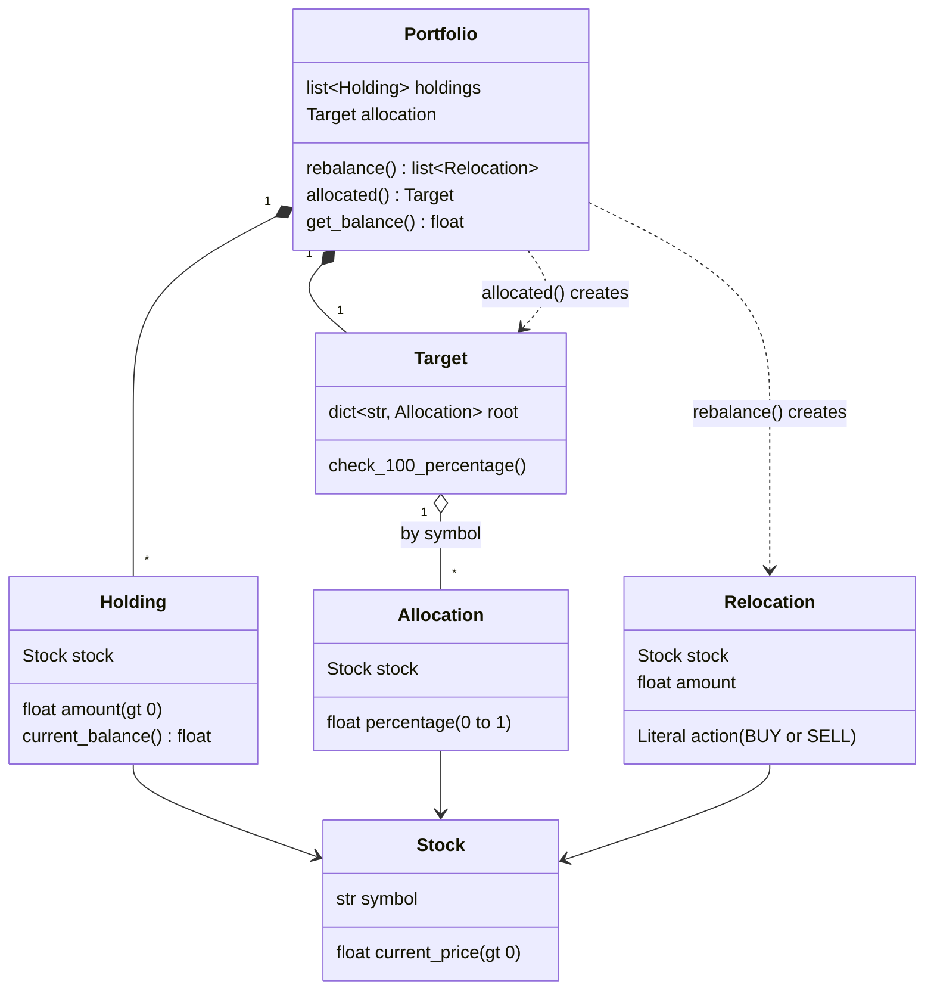

# Portfolio rebalance (Python)

A second solution to the assignment, written in Python by hand, without AI help, to keep practicing and for fun. The models are built with [pydantic](https://docs.pydantic.dev/) so validation comes almost for free.

## Run

You need a Python virtual environment with pydantic installed:

```bash
python -m venv venv
source venv/bin/activate
pip install pydantic
python demo.py
```

## Demo

`demo.py` builds a portfolio with 5 stocks (NVDA, AAPL, MSFT, AMZN, GOOGL) using their prices of the day it was written (2026-10-02), and a random number of shares (30 to 150) of each one. The target allocation is equally weighted (20% each), just for testing purposes. It prints the balance, the holdings, the current and target allocation, and the rebalance.

Because the shares are random, the output changes on every run. One example:

```
Balance: $160,183.99
Rebalance: [BUY 81.94 of NVDA, SELL 28.99 of AAPL, SELL 41.1 of MSFT, BUY 57.37 of AMZN, SELL 7.73 of GOOGL]
```

## Models

Defined in `schemas.py`.



- `Stock`: a symbol and its current price, which must be greater than 0.
- `Holding`: a stock and how many shares of it are owned (greater than 0). It knows its current balance (`price * amount`).
- `Allocation`: a stock and the percentage it should have in the portfolio, as a number from 0 to 1.
- `Target`: the allocations indexed by symbol. Its validator rejects any target that doesn't add up to 100%.
- `Relocation`: one instruction of the rebalance, `BUY` or `SELL`, with the number of shares to move.
- `Portfolio`: the holdings plus the target allocation.
  - `get_balance()` is the total value of the holdings.
  - `allocated()` is the current distribution, as a `Target`.
  - `rebalance()` is the list of relocations.

## How the rebalance works

For each holding:

1. The target value is `total balance * target percentage`.
2. The difference with the current value of the holding decides the action: positive means `BUY`, otherwise `SELL`.
3. The difference is converted to shares at the current price and rounded to 2 decimals.

## Decisions

- **The rebalance only moves the money the portfolio already has.** Sells pay for buys. There are no deposits and no withdrawals, so the total balance doesn't change.
- **A held stock that is not in the allocation is sold.** Its target is 0%.
- **A stock in the allocation that is not held is not bought.** The rebalance only goes through the holdings, so a missing stock is never added to the portfolio.
- **pydantic for the models.** Field constraints (`gt=0`, `ge=0, le=1`, `Literal`) and the `model_validator` on `Target` replace hand written validation code.
- **The result is expressed in shares**, not in money, and fractional shares are allowed.
